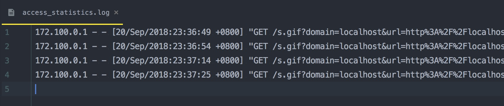

# Analytics 

轻量的前端统计框架

采集内容:

| 参数 | 获取方式 |
| ------------ | ------------ |
| 域名 | document.domain |
| URL | document.URL |
| 页面标题 | document.title |
| 分辨率 | window.screen.height & width |
| 颜色深度 | window.screen.height & width |
| 分辨率 | window.screen.colorDepth |
| Referrer | document.referrer |
| 浏览客户端 | navigator.userAgent |
| 客户端语言 | navigator.language |

## 前端使用

直接在页面嵌入script

```markdown
<script>
    // 日志服务地址
    var analytics_server = 'https://www.helingfeng.com/s.gif';
    
    // 初始化脚本
    (function () {
        var _analytics = document.createElement('script');
        _analytics.type = 'text/javascript';
        _analytics.async = true;
        _analytics.src = 'https://www.helingfeng.com/analytics/dist/main.js';
        var _script = document.getElementsByTagName('script')[0];
        _script.parentNode.insertBefore(_analytics, _script);
    })();
</script>
```

示例文件：example/index.html

## 日志服务

以`Nginx`为例

```markdown
location /s.gif {
     # 设置图片格式，不缓存
     default_type image/gif;
     add_header Expires "Fri, 01 Jan 1980 00:00:00 GMT";
     add_header Pragma "no-cache";
     add_header Cache-Control "no-cache, max-age=0, must-revalidate";

     # 返回空图片
     empty_gif;
}
```

## AccessLog 采集记录

